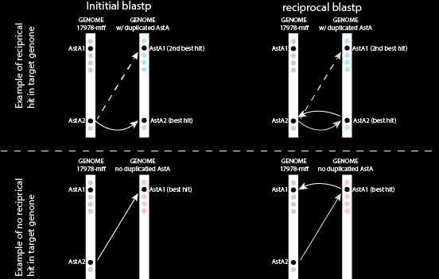

## Reciprocal blast

dependencies: 
BLAST+  <a href="https://www.ncbi.nlm.nih.gov/books/NBK569861/#intro_Installation.MacOSX">Install</a>
 
<a href="https://www.ncbi.nlm.nih.gov/books/NBK279691/">BLAST+ user manual</a>
 
1) build individual local blast databases from proteomes   
2) blasting each database with an input fasta protein    
3) turning best hit in each of the results from 2) into an individual fasta for rblast   
4) running each best hit from 3) against the genome containing the original query sequence   
5) building csv for results in 4  
 
## Building blastp databases:  
 
1) Get fasta-formatted proteomes and put each fasta file into a proteomes directory  
2) use the script "make_blastdb_each_proteome.sh" to build blastp database from each proteome  
 
